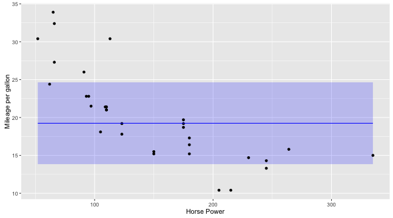

## Predictors
Three predictors are used:

 1. Horse Power (`hp`)
 1. Weigth (`wt`)
 1. Transmission Type (`am`)

Also:
 * Predictors can be adjusted using three input widgets.
 * Whenever one of the widget changes the plor gets updated. 

---

## Prediction plot
 * the prediction (blue line) 
 * the 95% confidence interval (light blue box)
 * data points (black)

---

## Source code

https://github.com/elibus/FuelConsumption

